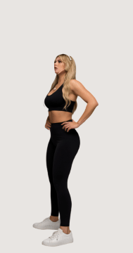
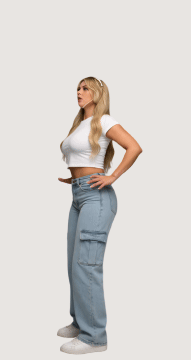
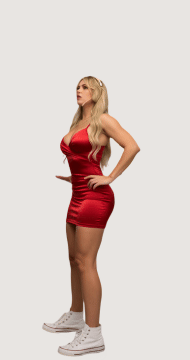
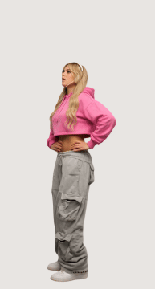

# bootybounce

A desktop pet for Windows. A cut-out person stands on your taskbar and loops her animation in the background, in the outfit you pick. Drag her somewhere, let go, and she drops back onto the taskbar.

## Outfits

| Gym | Denim | Red Dress | Hoodie |
|:-:|:-:|:-:|:-:|
|  |  |  |  |

All four were generated from one source clip: the outfit changed on one frame with Krea 2 Identity Edit, then Wan 2.2 Animate made her do the clip's motion in it.

## Use

Download `bootybounce-windows.zip` from [Releases](../../releases), unzip it and run `bootybounce.exe`. Keep the `pets` folder next to the exe.

- Left drag moves her. Release and she falls back onto the taskbar.
- Right click opens the menu: pick a person, her outfit, the size (Small, Medium, Large), always on top, quit.
- Clicks next to her go through to whatever is behind.
- Person, outfit, size, position and on-top are remembered in `%APPDATA%\Godot\app_userdata\bootybounce\settings.cfg`.

Mint is an AI-generated person.

## Add a person or an outfit

Every person is a folder in `pets/`, with one folder per outfit:

```
pets/Person/Outfit/
  frames/0001.png ...   RGBA frames, full resolution
  hit.json              click polygon per frame
  pet.cfg               fps and pingpong=true|false
```

The program lists these folders, so a new person or outfit shows up in the menu without rebuilding.

`tools/make_pet.py` makes such a folder from a video. It pulls the frames, paints out a burned-in caption, cuts the person out with BEN2 through a ComfyUI that has the [ComfyUI-RMBG](https://github.com/1038lab/ComfyUI-RMBG) nodes, picks a loop (a clean cut if the video has one, otherwise ping-pong between two still poses) and removes the old background colour from the edges. Ping-pong loops slow down to a stop before they turn, with in-between frames from optical flow, so the turn does not jerk.

```
pip install numpy opencv-python-headless imageio-ffmpeg
python3 tools/make_pet.py video.mp4 Person/Outfit --comfy http://<comfyui-host>:8188 [--caption Y0,Y1] [--box X0,Y0,X1,Y1] [--loop A,B]
```

Mint's source clip went through it with `--caption 380,540 --box 100,380,620,1080 --loop 0,186`: the whole clip forward and back, 13 seconds.

A new outfit for a person who already has a clip takes four more scripts. They talk to ComfyUI (`COMFY=http://host:port`) and work in make_pet.py's work folder of the source clip (`WORK=...`):

1. `tools/outfit_images.py`: the outfit changed on frame 1 with Krea 2 Identity Edit (prompts and seed at the top).
2. `tools/pose_video.py`: the motion as a DWPose skeleton video plus face crops, 16 fps, 576x768. Once per person.
3. `tools/wan_animate.py OUTFIT`: Wan 2.2 Animate makes the outfit image do the motion (about 12 minutes on an RX 7900 XT).
4. `tools/double_fps.py OUTFIT_s4242 film_net_fp16.safetensors`: 16 to 32 fps with FILM.

Then `make_pet.py WORK/wan/OUTFIT_s4242_x2_film_net_fp16.mp4 Mint/OUTFIT --box 0,0,576,768 --loop 0,200` as above.

## Develop

Godot 4.7, compatibility renderer, one script (`pet.gd`).

- `godot --headless --path . --script res://test.gd` checks every pet (frames, click polygons, no jump in the loop).
- `bootybounce.exe -- --shot=out.png --frame=N [--pet=Name] [--size=Large]` saves what the window shows, with alpha, prints its state as JSON and quits.
- A tag `v*` makes GitHub Actions run the test, export the Windows build and attach the zip to a release.
